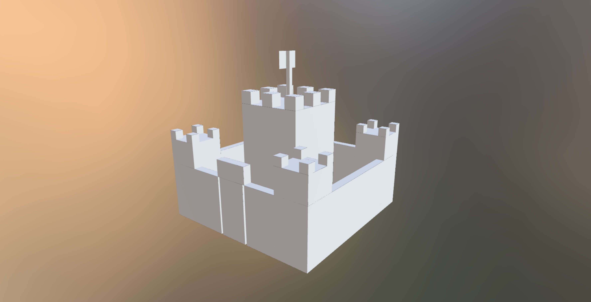

# BlockSmith

[](https://github.com/gbusto/blocksmith/actions/workflows/tests.yml)

**Generate block-based 3D models from text prompts using AI**

BlockSmith is a powerful Python library for generating block-style 3D models that are perfect for games, art, and procedural content.

## Features

- 🎨 **Text-to-3D**: Generate block models from simple text descriptions
- 🖼️ **Image-to-3D**: Generate from reference images (local files or URLs)
- 💻 **CLI + SDK**: Use from command line or Python code
- 🧱 **True Block Geometry**: Perfect cube geometry, not just "blocky-looking" models
- 🚀 **Lightweight**: Minimal dependencies, optimized for performance
- 🔄 **Multiple Formats**: Export to GLB, GLTF, BBModel (Blockbench), JSON, or Python DSL
- 📊 **Session Tracking**: Monitor token usage and costs
- 🤖 **Agent-Friendly**: Clean API perfect for AI coding assistants
- 🎮 **Game-Ready**: Optimized for engines like Hytopia, Minecraft mods, and more

## What You Can Do

**Generate from anything:**
```bash
# Text to 3D model
blocksmith generate "a castle" -o castle.glb
```


> **Tip:** You can view your generated GLB/GLTF files for free at [sandbox.babylonjs.com](https://sandbox.babylonjs.com/).

**Bring it to life:**
```bash
# Generate a character
blocksmith generate "a blocky robot" -o robot.py

# Animate it
blocksmith animate "walk cycle" -m robot.py -o walk.py

# Link together
blocksmith link -m robot.py -a walk.py -o robot_animated.glb
```

```bash
# Image to 3D model
blocksmith generate "blocky version" --image photo.jpg -o model.glb
```

**Convert between formats:**
```bash
# Import existing models and convert them
blocksmith convert model.glb model.bbmodel      # GLB → Blockbench
blocksmith convert tree.gltf tree.json         # GLTF → BlockJSON
blocksmith convert castle.bbmodel castle.glb   # Blockbench → GLB
```

**Use it from Python:**
```python
from blocksmith import Blocksmith

bs = Blocksmith()

# Generate and save in any format
bs.generate("a tree").save("tree.bbmodel")       # Blockbench
bs.generate("a car").save("car.glb")             # Game-ready GLB
bs.generate("a robot").save("robot.json")        # BlockJSON schema
bs.generate("a house").save("house.py")          # Python DSL code

# Generate with images
bs.generate("turn this into blocks", image="photo.jpg").save("model.glb")

# Track your usage and costs
result = bs.generate("a spaceship")
print(f"Tokens: {result.tokens.total_tokens}")
print(f"Cost: ${result.cost:.4f}")
```

**Why BlockSmith?**
- ✅ **No manual modeling** - Describe what you want, get a 3D model
- ✅ **Perfect for games** - True block geometry, not approximations
- ✅ **Multiple output formats** - Works with Blender, Blockbench, game engines
- ✅ **Import existing models** - Convert your GLB/GLTF files to other formats
- ✅ **Track your costs** - Know exactly how much each generation costs
- ✅ **Fast iteration** - Regenerate until you get what you want

## Installation

> **Note:** This is an alpha release (v0.0.1). Not yet published to PyPI.

**Requirements:** Python 3.12+

### 1. Clone and Install

```bash
# Clone the repository
git clone https://github.com/gbusto/blocksmith.git
cd blocksmith

# Create virtual environment
python3.12 -m venv .venv
source .venv/bin/activate  # On Windows: .venv\Scripts\activate

# Install in editable mode
pip install -e .

# Updating to latest version:
# git pull origin main
# pip install -e .  # Re-run if dependencies changed
# If you hit weird import errors:
# deactivate && source .venv/bin/activate
```

### 2. Set Up API Key

BlockSmith uses **Gemini 2.5 Pro** by default (best quality for block models).

**Get a free API key:**
1. Visit [Google AI Studio](https://aistudio.google.com/apikey)
2. Click "Create API Key" in the top left and follow the instructions
3. Copy your key

If you need help with this, let me know. OR, just use OpenAI, or even a free and local model if you want. If you run into a lot of issues with 429/rate limit errors, it's worth adding your billing info to get more use out of Gemini.

**Set the environment variable:**

```bash
# macOS/Linux - Add to ~/.bashrc or ~/.zshrc
export GEMINI_API_KEY="your-key-here"

# Or set for current session only
export GEMINI_API_KEY="your-key-here"

# Windows (PowerShell)
$env:GEMINI_API_KEY="your-key-here"

# Windows (Command Prompt)
set GEMINI_API_KEY=your-key-here
```

**Verify it's set:**
```bash
echo $GEMINI_API_KEY  # Should print your key
```

### 3. Install Blender (Optional)

**Skip this if you only need BBModel, JSON, or Python DSL formats!**

BlockSmith uses Blender's GLTF exporter for GLB/GLTF output. Install if you need 3D game-ready formats.

I recommend installing it straight from their site, and noting it's location on disk. OR, use one of the methods below to install it:

**macOS:**
```bash
brew install --cask blender
```

**Linux:**
```bash
sudo apt install blender  # Ubuntu/Debian
```

**Windows:**
Download from [blender.org/download](https://www.blender.org/download/)

**Verify Blender is installed:**
```bash
blender --version  # Should print Blender version
```

If `blender` command not found, add Blender to your PATH or set `BLENDER_PATH`:
```bash
# macOS
export BLENDER_PATH="/Applications/Blender.app/Contents/MacOS/Blender"

# Linux (if not in PATH)
export BLENDER_PATH="/usr/bin/blender"
```

## Quick Start

### CLI (Easiest)

```bash
# Generate a model from text
blocksmith generate "a medieval castle" -o castle.bbmodel

# With reference image
blocksmith generate "turn this into blocks" --image photo.jpg -o model.glb

# Convert between formats
blocksmith convert castle.bbmodel castle.glb

# Animation Workflow
blocksmith animate "wave hand" -m steve.py -o wave.py
blocksmith link -m steve.py -a wave.py -o steve_animated.glb
```

### Python SDK

```python
from blocksmith import Blocksmith

# Initialize (reads GEMINI_API_KEY from environment)
bs = Blocksmith()

# Generate a model
bs.generate("a medieval castle").save("castle.bbmodel")
```

**That's it!** You now have a 3D model ready to use.

## Usage

### CLI Usage

**Generate models:**
```bash
# Basic generation
blocksmith generate "a car" -o car.glb

# With different model (faster/cheaper)
blocksmith generate "a tree" -o tree.bbmodel --model gemini/gemini-2.5-flash-lite

# With reference image (local or URL)
blocksmith generate "blocky version" --image photo.jpg -o model.glb
blocksmith generate "turn this into blocks" --image https://example.com/car.jpg -o car.glb

# Show detailed stats
blocksmith generate "a castle" -o castle.glb --verbose
```

**Convert formats:**
```bash
# Convert between any supported formats
blocksmith convert model.glb model.bbmodel
blocksmith convert castle.json castle.gltf
blocksmith convert tree.bbmodel tree.json
```

**Get help:**
```bash
blocksmith --help
blocksmith generate --help
blocksmith --help
blocksmith generate --help
blocksmith convert --help
blocksmith animate --help
blocksmith link --help
```
### Animation Workflow

**1. Generate Animation Code:**
```bash
# Creates a Python file containing just the animation logic
blocksmith animate "make it run" -m model.py -o run.py
```

**2. Link to Model:**
```bash
# Merges the model and animation(s) into a GLB
blocksmith link -m model.py -a run.py -o final.glb

# You can stick multiple animations together!
blocksmith link -m model.py -a walk.py -a run.py -a jump.py -o final.glb
```

### ⚠️ Animation Caveats & Best Practices

1.  **Centered Pivots:** If you want an object to rotate around its center (like a floating cube), the **Model** must have a Group pivot at its geometric center.
    *   *Bad:* A cube at `[0,0,0]` will rotate around the bottom-left corner.
    *   *Good:* A cube inside a Group at `[0, 0.5, 0]` will rotate around its center.
    *   *Fix:* Ask the generator for "a cube centered at 0,0,0 ready for rotation".
2.  **Speed**: LLMs tend to generate very fast animations (1.0s). For smooth loops, try asking for "slow, smooth rotation" or specifically "2 to 4 seconds duration".
3.  **Forward Direction**: In BlockSmith, **North is -Z**.
    *   Arms raising "Forward" will rotate towards -Z.
    *   The LLM knows this, but sometimes needs reminders for complex moves.

### Python SDK Usage

**Basic generation:**
```python
from blocksmith import Blocksmith

bs = Blocksmith()

# Generate and save directly
bs.generate("a car").save("car.glb")

# Access generation results and metadata
result = bs.generate("a tree")
print(result.dsl)     # Python DSL code
print(result.tokens)  # TokenUsage(prompt=13720, completion=2909, total=16629)
print(result.cost)    # 0.046 (USD) or None for local models
print(result.model)   # "gemini/gemini-2.5-pro"

# Explicitly convert DSL to BlockJSON
block_json = result.to_json()
print(block_json["entities"])
```

### Save Multiple Formats

```python
result = bs.generate("a spaceship")

# Save in different formats from the same generation
result.save("spaceship.glb")      # Binary GLB (requires Blender)
result.save("spaceship.gltf")     # GLTF JSON (requires Blender)
result.save("spaceship.bbmodel")  # Blockbench format
result.save("spaceship.json")     # BlockJSON schema
result.save("spaceship.py")       # Python DSL source
```

### Advanced Features

**Use different LLM models:**
```python
# Use Gemini Flash Lite (fastest, cheapest)
bs = Blocksmith(default_model="gemini/gemini-2.5-flash-lite")

# Use OpenAI (requires OPENAI_API_KEY)
bs = Blocksmith(default_model="gpt-5")

# Or override per-generation
result = bs.generate("a tree", model="gemini/gemini-2.5-flash")
```

**Supported Providers:**
- **Gemini** (recommended): `gemini/gemini-2.5-pro`, `gemini/gemini-2.5-flash`, `gemini/gemini-2.5-flash-lite`
- **OpenAI**: `gpt-4o`, `gpt-4o-mini`
- Any model supported by [LiteLLM](https://docs.litellm.ai/docs/providers)

**Generate with reference images:**
```python
# Local image file
result = bs.generate(
    "turn this into a blocky model",
    image="photo.jpg"
)

# Remote image URL
result = bs.generate(
    "blocky version of this car",
    image="https://example.com/car.jpg"
)
```

**Track session statistics:**
```python
bs = Blocksmith()

# Generate some models
bs.generate("a cube").save("cube.glb")
bs.generate("a tree").save("tree.glb")

# Get session stats
stats = bs.get_stats()
print(stats)
# {
#   'model': 'gemini/gemini-2.5-pro',
#   'call_count': 2,
#   'total_tokens': 33258,  # ~16.6k per call
#   'total_cost': 0.092,    # ~$0.046 per call
#   'avg_tokens_per_call': 16629
# }

# Reset stats
bs.reset_stats()
```

**Convert between formats:**
```python
from blocksmith import convert

# Module-level converter
convert("model.glb", "model.bbmodel")
convert("castle.json", "castle.gltf")

# Or use the client method
bs = Blocksmith()
bs.convert("input.glb", "output.bbmodel")
```

## Examples

### Start Simple

```python
bs = Blocksmith()

# Basic shapes
bs.generate("a simple cube").save("cube.glb")
bs.generate("a pyramid").save("pyramid.glb")
bs.generate("a sphere made of blocks").save("sphere.glb")
```

### Simple Objects

```python
# Tools and items
bs.generate("a hammer").save("hammer.glb")
bs.generate("a torch").save("torch.glb")
bs.generate("a tree").save("tree.glb")
bs.generate("a chest").save("chest.glb")
```

### Characters

```python
# Keep it simple for best results
bs.generate("a minecraft-style person").save("person.glb")
bs.generate("a simple blocky robot").save("robot.glb")
```

### Buildings

```python
# Simple structures work better
bs.generate("a small house").save("house.glb")
bs.generate("a tower").save("tower.glb")
```

## Troubleshooting

### "No API key found" Error

**Problem:** `Exception: No GEMINI_API_KEY found`

**Solution:**
1. Make sure you set the environment variable:
   ```bash
   export GEMINI_API_KEY="your-key-here"
   ```
2. Verify it's set:
   ```bash
   echo $GEMINI_API_KEY
   ```
3. Restart your terminal or Python session after setting it

### "blender: command not found"

**Problem:** GLB/GLTF export fails with Blender not found

**Solution:**
1. **Option 1:** Install Blender (see installation instructions above)
2. **Option 2:** Use BBModel format instead (no Blender needed):
   ```python
   result.save("model.bbmodel")  # Works without Blender!
   ```
3. **Option 3:** Set BLENDER_PATH manually:
   ```bash
   export BLENDER_PATH="/Applications/Blender.app/Contents/MacOS/Blender"
   ```

### Models Look Wrong or Broken

**Problem:** Generated models have gaps, overlapping parts, or strange geometry

**Solutions:**
1. **Try a more specific prompt:** Instead of "a car", try "a simple blocky race car with wheels"
2. **Regenerate:** LLMs are non-deterministic, try generating again
3. **Use Gemini 2.5 Pro:** It's the best model for block geometry
   ```python
   bs = Blocksmith(default_model="gemini/gemini-2.5-pro")
   ```

### Import Errors

**Problem:** `ModuleNotFoundError: No module named 'blocksmith'`

**Solution:**
1. Make sure you installed the package:
   ```bash
   pip install -e .
   ```
2. Check you're in the right Python environment:
   ```bash
   which python  # Should point to your .venv
   pip list | grep blocksmith  # Should show blocksmith
   ```

## API Reference

### `Blocksmith`

Main client for generating models.

```python
Blocksmith(default_model="gemini/gemini-2.5-pro")
```

**Parameters:**
- `default_model` (str): LLM model to use (default: "gemini/gemini-2.5-pro")

**Methods:**
- `generate(prompt: str, model: str = None, image: str = None) -> GenerationResult`
  - `prompt`: Text description of the model to generate
  - `model`: Override the default model for this generation
  - `image`: Optional reference image (local file path or HTTP/HTTPS URL)

- `get_stats() -> dict`
  - Returns session statistics (call_count, total_tokens, total_cost, etc.)

- `reset_stats()`
  - Reset session statistics

- `convert(input_path: str, output_path: str)`
  - Convert a model from one format to another

### `GenerationResult`

Result object containing generated model and metadata.

**Properties:**
- `dsl: str` - Python DSL source code
- `tokens: TokenUsage` - Token usage (prompt_tokens, completion_tokens, total_tokens)
- `cost: float | None` - Cost in USD (None for local models)
- `model: str` - Model used for generation

**Methods:**
- `to_json() -> dict`
  - Explicitly convert Python DSL to BlockJSON schema

- `save(path: str, filetype: str = None)`
  - Save to file (auto-detects format from extension)
  - `path`: Output file path
  - `filetype`: Optional format override ('py', 'json', 'bbmodel', 'gltf', 'glb')

## How It Works

1. **LLM Generation**: Uses an LLM to generate clean Python DSL code
2. **Validation**: Validates the generated code and entities
3. **Conversion**: Converts to BlockJSON schema, then to GLTF
4. **Export**: Outputs in your desired format

## BlockJSON Schema

BlockSmith uses a central JSON schema (BlockJSON) that makes it easy to convert between formats:

```
Python DSL ←→ BlockJSON ←→ GLTF/GLB
                 ↕
           Other formats
      (bedrock, bbmodel, etc)
```

This design allows for:
- Clean, human-readable Python code generation
- Easy validation and manipulation
- Support for multiple output formats

## Limitations (v0.1)

This is an alpha release focused on core features. Current limitations:

- ⚠️ **Requires Blender** for GLB/GLTF export only (BBModel, JSON, Python DSL work without Blender)
- ❌ No animation support yet (coming in v0.2)
- ✅ Geometry generation works great!
- ✅ CLI, SDK, image support, and format conversion all working!

## Roadmap

**v0.1 (Current)**
- ✅ Core model generation
- ✅ Multi-format export (GLB, GLTF, BBModel, JSON, Python DSL)
- ✅ Image-based generation (reference images)
- ✅ CLI tool with generate and convert commands
- ✅ Session statistics and cost tracking
- ✅ Format conversion API

**v0.2 (Planned)**
**v0.2 (Planned)**
- [x] Animation support (Basic)
- [ ] Blockbench plugin
- [ ] Web UI

## Contact

Feel free to email me at blocksmithai.app @ gmail[.]com, or [reach out on X](https://x.com/gabebusto)

## Contributing

Contributions welcome! This is an early-stage project.

## License

MIT License - see [LICENSE](LICENSE) for details

## Links

- [GitHub](https://github.com/gbusto/blocksmith)
- [Documentation](https://github.com/gbusto/blocksmith#readme)
- [Issues](https://github.com/gbusto/blocksmith/issues)

---

**Made with ❤️ by Gabriel Busto**

Generate anything you can imagine, one block at a time.
