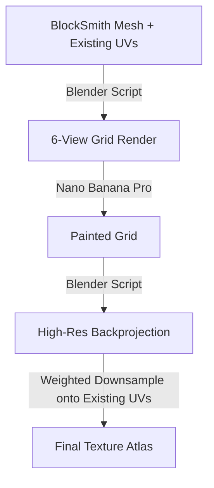

# Texturing Pipeline Design

This document outlines the proposed **Multi-View Backprojection** strategy for automating the texturing of BlockSmith models. The goal is to generate high-quality, consistent pixel-art textures from text prompts using 2D image-generation models.

**Reference Implementation:** Most of this logic is already implemented in `TEXTURING/`.

## High-Level Workflow

The pipeline consists of four main stages (see `TEXTURING/` scripts):

1.  **Stage 1: Multi-View Rendering** (`render_clay_grid.py`)
2.  **Stage 2: AI Painting** (`mvadapter_client.py`)
3.  **Stage 3: Weighted Backprojection** (`project_grid_texture.py`)
4.  **Stage 4: Pixel-Art Downsampling** (`downsample_texture.py`)

---

## Detailed Implementation

### Stage 1: Multi-View Rendering (Clay)
**Goal:** Create a "canvas" for the AI to paint on.

1.  **Input:** The untextured (clay) GLB model generated by BlockSmith.
2.  **Process:**
    *   Use a headless Blender script (`bpy`).
    *   Set up **6 cameras** to capture all angles:
        *   Front, Back, Left, Right (Orthographic or low FOV Perspective)
        *   Top, Bottom (Crucial for consistent heads/shoes)
    *   **Lighting:** Use neutral, soft lighting (HDRI or 3-point softbox) to show form without harsh shadows (shadows confuse UV extraction).
    *   **Output:** Save 6 individual images + a JSON file containing **Camera Intrinsics & Extrinsics** (Matrix World, Focal Length, Sensor Size) for every view.
    *   **Grid:** Composite these 6 images into a single `3x2` image grid. This helps the AI maintain consistency across views (e.g., ensuring the belt color matches on front and back).

### Stage 2: AI Painting (Nano Banana Pro)
**Goal:** Apply the desired aesthetic using **Nano Banana Pro** (Gemini 3 Pro Image Edit).

1.  **Input:** The `3x2` Clay Grid + Text Prompt.
2.  **Model:** **Nano Banana Pro** (MANDATORY). This model has superior spatial reasoning and texture consistency compared to standard VLMs.
3.  **Prompt Engineering:**
    *   Instruct Nano Banana Pro to "paint the clay model".
    *   "Maintain lighting consistency across the grid."
    *   "Output a flat, lit texture style suitable for game assets."
4.  **Output:** A `3x2` Painted Grid matching the input layout.

### Stage 3: Weighted Backprojection
**Goal:** Transfer the 2D painted pixels back onto the 3D geometry.

1.  **Input:** Painted Grid, Original Mesh, Camera Metadata.
2.  **Process (in Blender):**
    *   Load the mesh.
    *   For each of the 6 views:
        *   **Project** the corresponding sub-image from the grid onto the mesh geometry.
        *   Calculate a **Weight Map** for each view per face/vertex:
            *   **Normal Dot Product:** Faces pointing directly at the camera get weight `1.0`. Faces at glancing angles get lower weights.
            *   **Occlusion:** Raycast from camera to vertex. If blocked, weight = `0.0`.
    *   **Blend:** Combine pixel data from all 6 views using the Weight Maps.
        *   `FinalPixel = (View1 * W1 + View2 * W2 + ...) / (W1 + W2 + ...)`
    *   **Baking:** Bake this blended result into a high-resolution Texture Map (e.g., `2048x2048`).

### Stage 4: Pixel-Art Downsampling (Use Existing UVs)
**Goal:** Transfer the high-res painted data onto the **Already Existing BlockSmith UVs**.

1.  **Context:**
    *   BlockSmith **already** creates a perfect pixel-art UV layout and "Clay" atlas during the V3 JSON conversion process.
    *   These UVs are optimized for Minecraft-like resolutions (e.g., 32x32 per face).
    *   **CRITICAL:** Do NOT re-unwrap the model. We must bake the high-res backprojection *onto* these existing UV coordinates.

2.  **The Process (Weighted Downsampling):**
    *   The Backprojection (Stage 3) creates a temporary floating-point High-Res map (e.g., 2048x2048).
    *   For every pixel in the **Target Low-Res Atlas**:
        *   Identify the UV bounds of that texel.
        *   Sample the corresponding region from the Hihg-Res map.
        *   Calculate the **Average** or **Dominant** color.
    *   **Output:** Overwrite the original `clay_atlas.png` with this new color data.

## Technical Considerations

1.  **Seams:** The backprojection method naturally creates seams where camera views overlap. Using a **Feathered Weighting** (soft falloff based on normal angle) mimics "Triplanar Mapping" and hides seams effectively.
2.  **Occlusion:** It is critical to perform raycast checks during backprojection. Without this, the "Front" view might project onto the "Back" faces of the mesh (projecting through the object).
3.  **UV Layout:** BlockSmith already generates non-overlapping Box UVs (`clay_atlas.py`). This is perfect for this pipeline.
